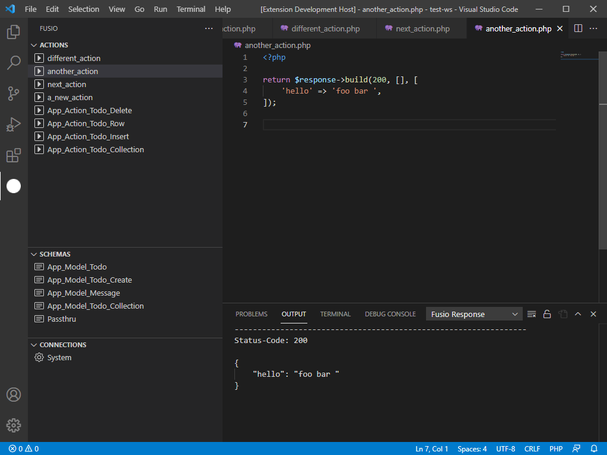
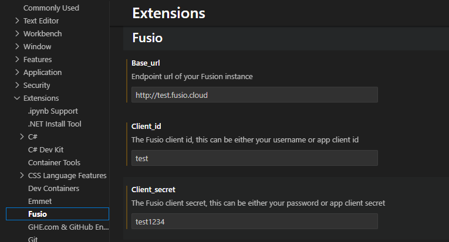

# Fusio VSCode extension

## Overview

This extension integrates Fusio support into VSCode. That means you can connect to a Fusio instance an load, create, update
and execute actions through VSCode. It provides a more advanced development environment for action developers. The extension
is available at the [marketplace](https://marketplace.visualstudio.com/items?itemName=Fusio.fusio). More information about
Fusio at: https://www.fusio-project.org/

On the left sidebar Fusio lists Actions, Schemas and Connections of your remote instance:

## Configuration

Past installation you only need to provide the Fusio Base-Url of your Fusio instance and a Client-Id and Secret, after this the extension is ready to use.

## Commands

The following commands are available:

* `fusio.login`

  Uses the credentials from the settings to authenticate the user.
* `fusio.logout`

  Revokes an active access token and removes any locally stored tokens.
* `fusio.action.open`

  This action is executed if you click on an action at the sidebar. Downloads the action code and writes the code to a local file in your workspace. The file name is equal to the action name. Note it will overwrite any existing file with the same name, since we assume that you want to obtain the current version from the server.
* `fusio.action.save`

  Triggered if you save a document, this action writes all changes back to the remote instance.
* `fusio.action.execute`

  Executes the action on the remote server and shows the response at the output panel. This useful for testing since you can execute an action even if the action is not attached to a route.
* `fusio.schema.open`

  Shows a HTML rendered version of the defined schema. This is especially useful if a developer needs to create an action which should follow the defined schema.
* `fusio.connection.open`

  Shows an API documentation which can be helpful if you want to use this connection in your action.

## Completion

Besides the commands this extension registers an auto completion provider which tries to provide some useful suggestions for action development.
